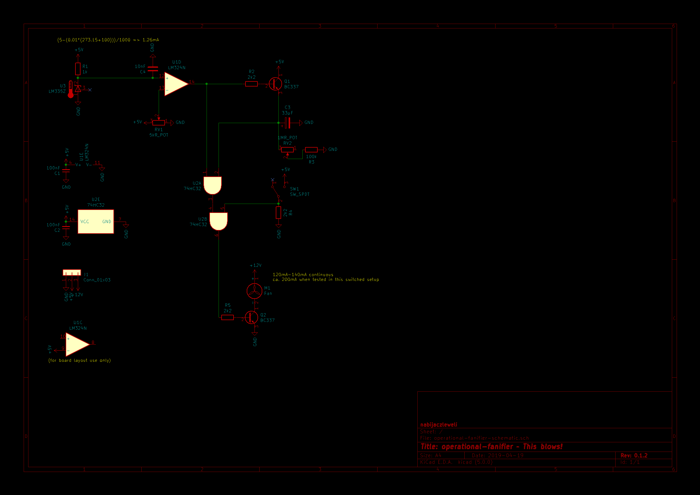
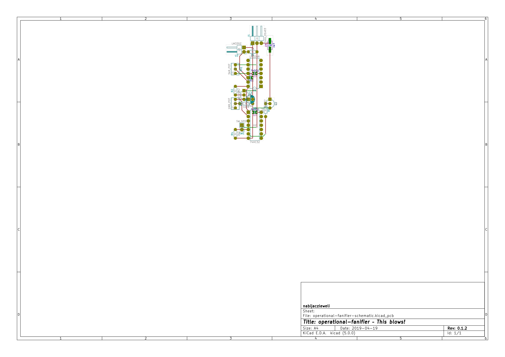
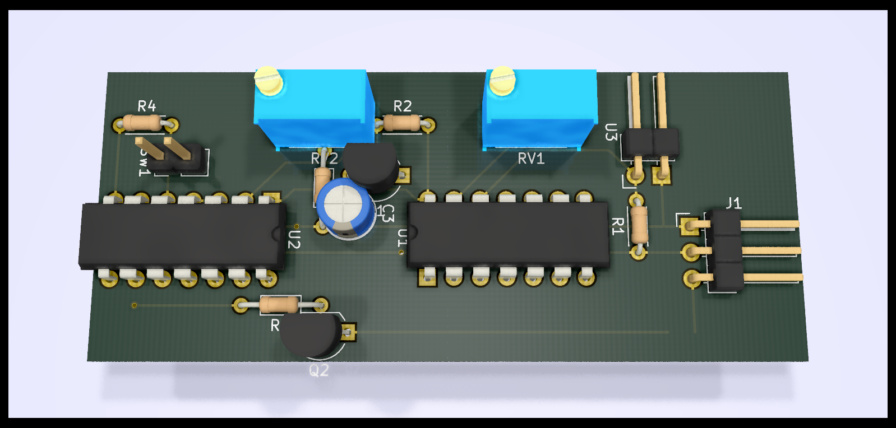

# operational-fanifier 
This blows!

## What?

Automatic analogue tunable temperature-activated fan for the inside of one of my ATX supplies.

## Why?

The original fan is (a) loud and (b) runs continuously, this will probably help avoid the first through cutting down on the second.

## Whom with?

An [LM324N Op-Amp](//ti.com/lit/ds/symlink/lm324-n.pdf),
a [74HC32 Quad OR Gate](//mouser.com/ds/2/308/74HC32.REV1-102593.pdf),
a [LM335Z Kelvin-Calibrated Temperature Sensor](//ti.com/lit/ds/symlink/lm335.pdf),
and a handful of generics.

## How?

#### Schematic

#### Short description

Starting from the top-left, we can see the Temperature Sensor (`U3`), to be mounted onto the target heatsink, leading into an op-amp unit (`U1D`),
  which compares it to the customisable potentiometer (`RV1`) voltage divider.
As for the use of a quad op-amp when using only one unit thereof – these were vastly (15x/pc.) cheaper at my local shop,
  and have not been chosen due to any specific characteristics.

Thus, if the reading from the Sensor is higher than the pre-set voltage, the output will also go high, which will lead to two things:
  (a) pulling one input of the primary OR gate (`U2A`) high, and
  (b) charging the timing capacitor (`C3`) via the timing input transistor (`Q1`).

The timing capacitor's discharge rate can be controlled via the customisable potentiometer (`RV2`),
  which will, with the given `C1 = 33µF`, `R3 = 100kΩ`, and `RV2 = 1MΩ` values and the datasheet-specified threshold voltage of `Vₜₕ = 0.7V𝒸𝒸`
  as well as perfect linearity and full opening charge, vary between `0.7 * 33µF * (100kΩ + 0) = 2.31s` and `0.7 * 33µF * (100kΩ + 1MΩ) = 25.41s`.

The positive terminal of the timing capacitor is tied to the other input of the primary OR gate, meaning it will keep it active for longer than just the Sensor would.

The output fo the primary OR gate leads into one of the inputs of the secondary OR gate (`U2B`),
  whose second input is tied directly to a pulled-down bistable override switch (`SW1`),
  flipping whichof will turn on the fan (`M1`) regardless of any earlier autonomous stages (i.e. everything from the Sensor to the primary OR gate output).

Which means, that if either the override switch is on. the temperature sensor reads above the preuser-specified temperature,
  or the timer capacitor hasn't gone below the threshold voltage, the fan will be turned on via the primary transistor (`Q2`).

#### Layout

The layout is very cramped due to my use of a very peculiar perfboard; it probably could've been solved much cleaner otherwise.

#### Model

Note that some components (notably `U3` and `SW1`) use more pins than in the real-world version –
  that is due to the fact that I couldn't find the way to force-assign a three-terminal element a two-terminal footprint.
